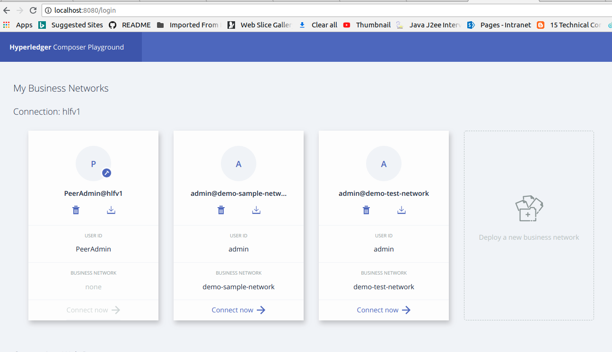

# blockchain-hyperledger-fabric-demo
This project explains how blockchain works in IBM Hypledger Fabric with simple application

In this demo project, I have taken a simple transcation. For example PersonA transfer some amount to Person B an viceversa.

### Hyperledger Fabric Installation

Follow the below link to install hyperledger fabric

***pre-requisites:***

https://hyperledger.github.io/composer/latest/installing/installing-prereqs

***Development Environment***
https://hyperledger.github.io/composer/latest/installing/development-tools

### Demo Application ###

1. Start the Fabric Server

```
Open Terminal and Go to fabric-dev-servers location and run ./startFabric.sh
 
```
2. Run the docker container

3. Run this command to create the busniess network compose-playground

4. Deploy a new busniess network

   Here I have created demo-test-network
    
   
  
5. Create an asset in the busniess network

   Here I am creating simple Account model like this
