# blockchain-hyperledger-fabric-demo
This project explains how blockchain works in IBM Hypledger Fabric with simple application

In this demo project, I have taken a simple transcation. For example PersonA transfer some amount to Person B an viceversa.

### Hyperledger Fabric Installation

Follow the below link to install hyperledger fabric

***pre-requisites:***

https://hyperledger.github.io/composer/latest/installing/installing-prereqs

***Development Environment***
https://hyperledger.github.io/composer/latest/installing/development-tools

### Demo Application ###

1. Start the Fabric Server

```
Open Terminal and Go to fabric-dev-servers location and run ./startFabric.sh
 
```
2. Run the docker container

3. Run this command to create the busniess network
  
   ```
   composer-playground
   
   ```
  
4. Deploy a new busniess network

   Here I have created demo-test-network
    
   
  
5. Create an asset in the business network

   Here I am creating simple asset, Participant and transcation in model like below
   
   In this application asset is Account, participant is Customer and transcation is AccountTransfer
   
   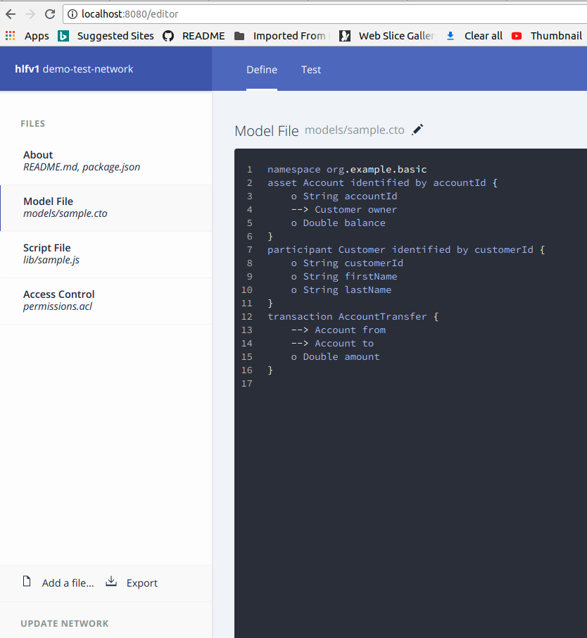
   
6. Create busniess logic for the transcation between PersonA and PersonB.

   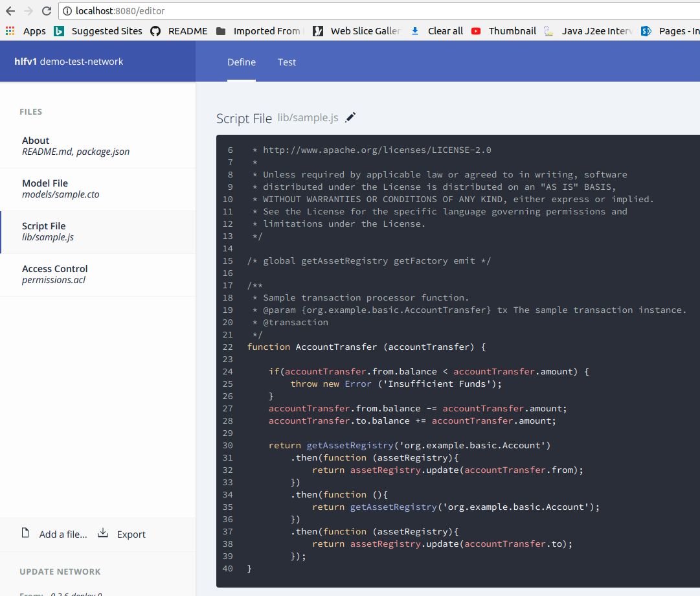
   
7. Make Permissions for the Asset, Participant and Transcation

   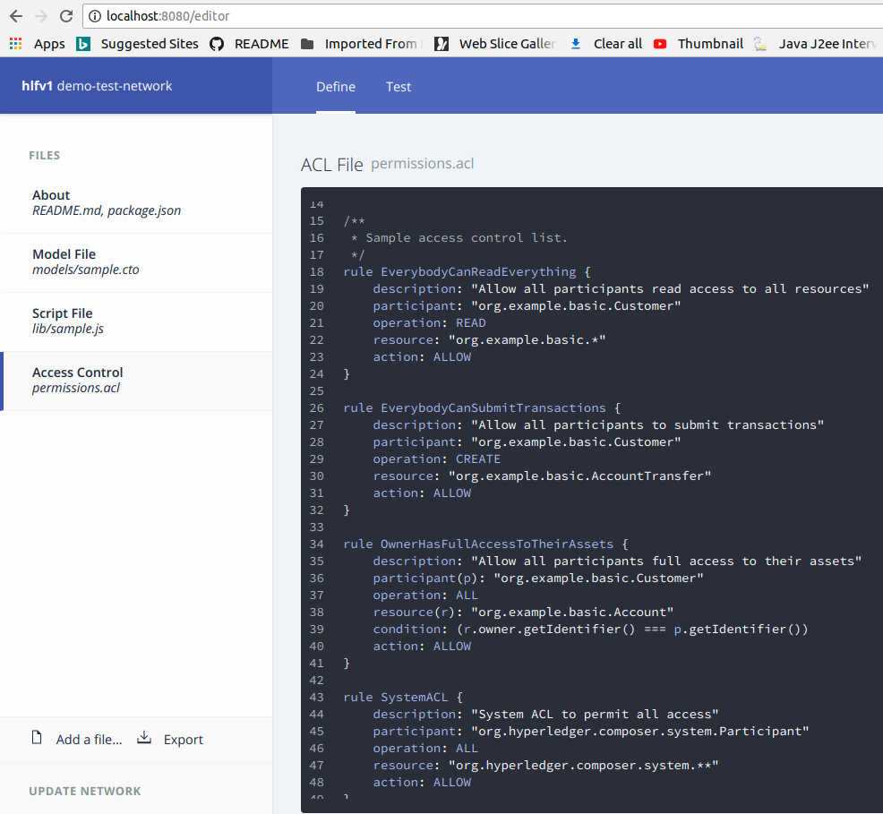
   
8. Deploy the changes.

9. Test the changes.

   * Create Customer
   
   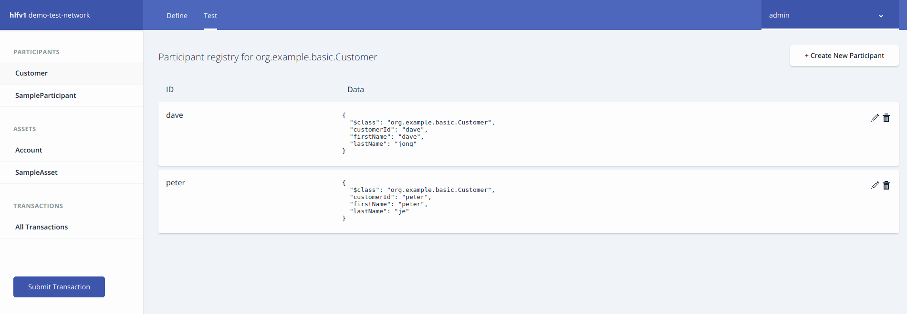
   
   * Create Account for the customer
   
   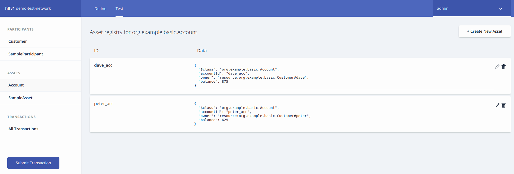
   
   * Create Transcation between PersonA and PersonB
   
   Here I have transferred some amount from PersonA to PersonB and viceversa.
   
   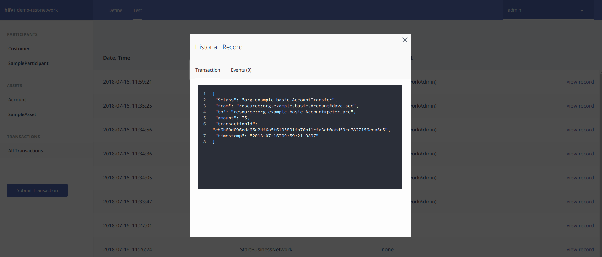
   
 10. Export the busniess nextwork from the composer playground portal. Click Export link
     ```
    demo-test-network.bna
    ```
 11. Export the busniess card for network install from the composer playground.

     In this application, I have created busniess card name as ***admin@demo-test-network*** initally.
     
     Also I have created the card from PeerAdmin@hlfv1
 
      ```
      demo-test.card
      ```
  12. Install the busniess network by using this command
  
      ```
      composer network install --card PeerAdmin@hlfv1 --archiveFile /path/demo-test-network.bna

      ```
  
  13. Run the below command to check the busniess card using REST API.
  
      ```
      composer-rest-server
      
      ```
   
      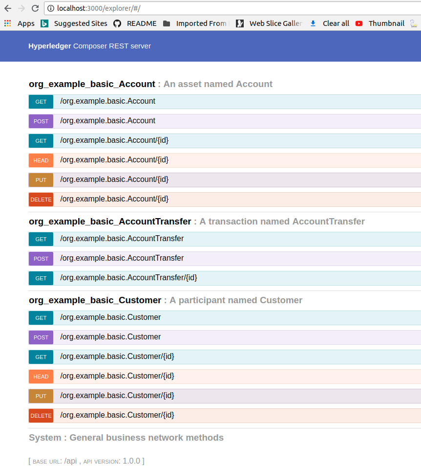
      
   14. Access the busniess card from the frontend. Hyperledger fabric support angular for the frontend.
   
       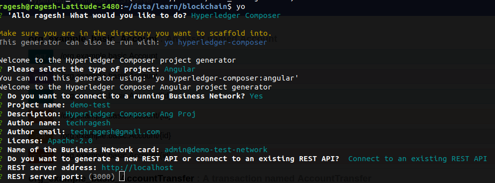
       
       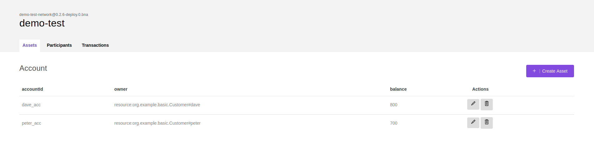
       
       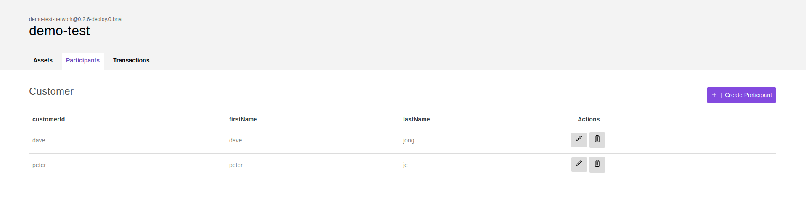
       
       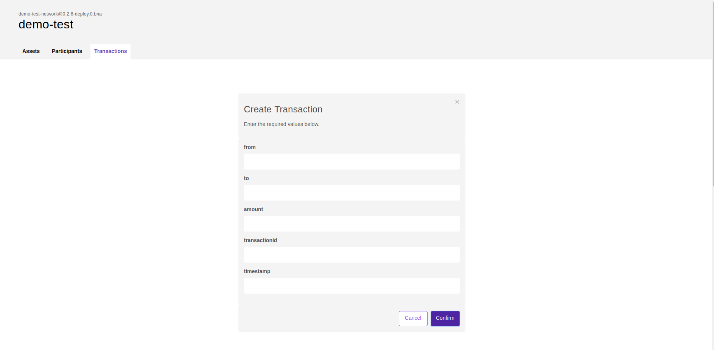
       
    
  ### Happy Coding ###
    
